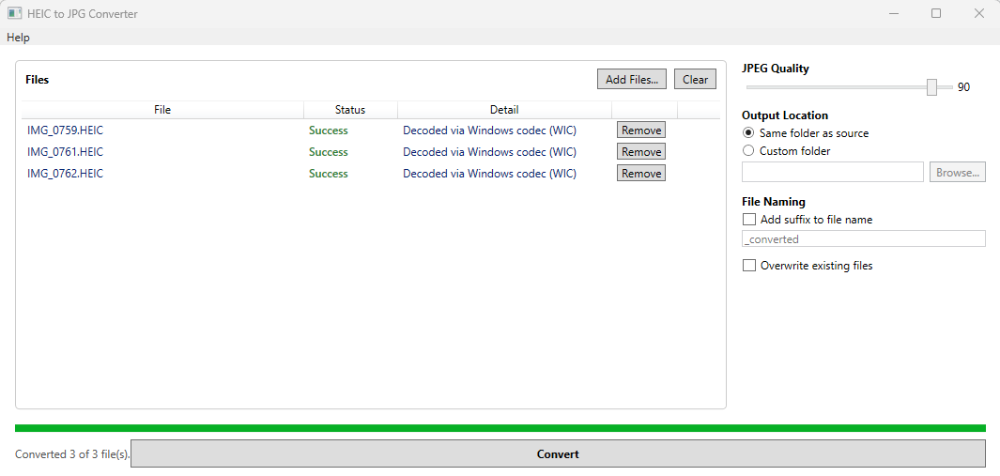

# HEIC to JPG Converter

A free Windows desktop app for converting `.HEIC`/`.HEIF` photos — the format iPhones
and some Android/Google Photos exports use by default — into standard `.JPG` files
that open everywhere. Built for non-technical users: drag files in, hit Convert, done.



## Features

- Drag-and-drop or file picker, single files or whole folders
- Batch conversion with progress tracking and cancel support
- Adjustable JPEG quality
- EXIF metadata (camera info, date taken, GPS, etc.) preserved in the output
- Choose to save alongside the originals or to a custom folder, with optional filename suffix
- Installs per-user, no administrator rights required
- Optional "Send To" shortcut — select one or more `.HEIC`/`.HEIF` files in Explorer,
  right-click, and send them straight to the app to convert

## Download

Grab the latest installer (`HeicToJpgSetup.exe`) from the [Releases](../../releases)
page. It installs to your user profile — no admin prompt, no system-wide changes.

**Note:** Windows will likely show a "Windows protected your PC" SmartScreen warning
with "Unknown publisher" when you run the installer. This is expected — the installer
isn't code-signed, so Windows doesn't yet recognize it as safe. To proceed, click
**"More info"**, then **"Run anyway."**

## Requirements

- Windows 10 or 11, 64-bit
- No separate .NET install needed — the app is self-contained

## Known limitations

Most `.HEIC` files decode using the bundled `libheif` library. Some newer HEIC files
(for example, iPhone 15 Pro and later, or photos using Apple's Adaptive HDR format)
aren't yet supported by that library and automatically fall back to the Windows
Imaging Component (WIC) instead — the app shows which decoder handled each file in
the **Detail** column. WIC-based decoding requires Windows' free
[HEIF Image Extensions](https://apps.microsoft.com/detail/9pmmsr1cgpwg) and an HEVC
video extension (also from the Microsoft Store) to be installed. These typically
come pre-installed on consumer PCs; if a file fails to convert, installing those two
Store extensions usually resolves it.

## Building from source

Requires the [.NET 8 SDK](https://dotnet.microsoft.com/download/dotnet/8.0).

```
dotnet publish src\HeicToJpg.App\HeicToJpg.App.csproj -c Release -r win-x64 --self-contained true -p:PublishSingleFile=true -p:IncludeNativeLibrariesForSelfExtract=true -p:DebugType=none -p:DebugSymbols=false -o publish\win-x64
```

To build the installer, install [Inno Setup](https://jrsoftware.org/isinfo.php) and run:

```
ISCC installer\HeicToJpg.iss
```

## License

Source code is licensed under the [MIT License](LICENSE). See
[THIRD-PARTY-NOTICES.md](THIRD-PARTY-NOTICES.md) for the licenses of bundled
third-party components (libheif, LibHeifSharp, SixLabors.ImageSharp,
CommunityToolkit.Mvvm).
